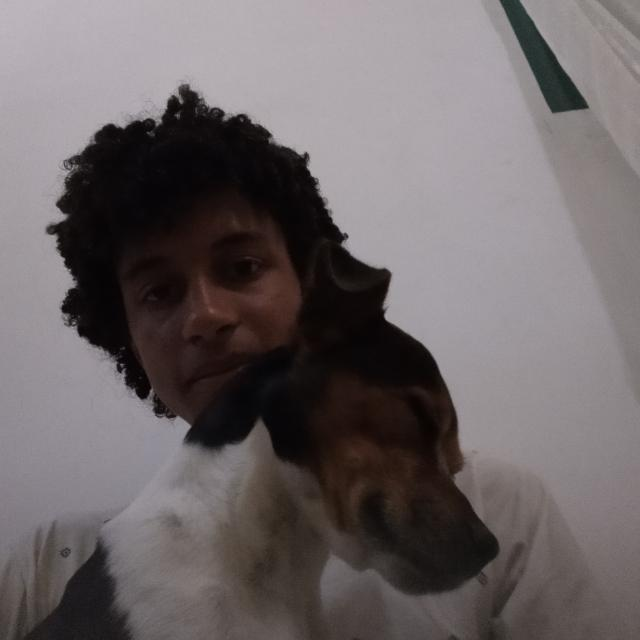
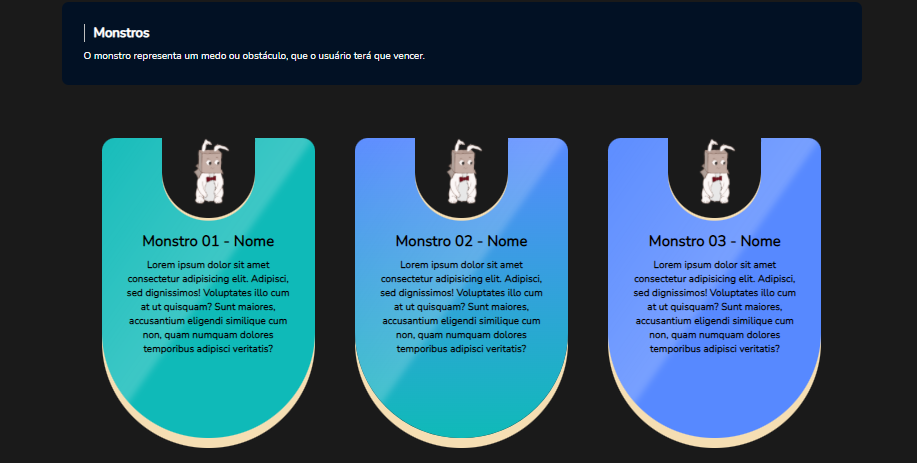

<h1>PROJETO DE TCC - CONVERSE+</h1>

<h2>INFORMAÇÕES: </h2>

:man_student: :writing_hand:	

Converse+, é um aplicativo voltado para desenvolver e aprimorar as habilidades sociais (positividade, comunicação, empatia, civilidade, enfrentamento e trabalho) e mostrar a importância das mesmas.

:face_exhaling: :eyes:	

Para que o usuário, possa ter uma interatividade maior com as atividades propostas, em cada sessão. Será utilizado um sistema de gamificação.

<h2>TECNOLOGIAS USADAS:</h2>

<table>
    <th>
        
    </th>
    <th>    
        
    </th>
    <th>
        
    </th>
    <th>
        
    </th>
</table>

<h2>INTEGRANTES:</h2>

<table>
    <th>
        
    </th>
    <th width="80%">
        <strong>Carolina Beserra</strong>
    </th>
    <tr>
        <th>
            
        <th width="80%">
            <strong>Guilherme Leme</strong>
        </th>
    <tr>
        <th>
            
        </th>
        <th width="80%">
            <strong>Marco Antonio</strong>
        </th>
    <tr>
    <tr>
        <th>
            
        </th>
        <th width="80%">
            <strong>Juliano Bittencourt</strong>
        </th>
    <tr>
    <tr>
        <th>
            
        </th>
        <th width="80%">
            <strong>Nilmar Huarachi</strong>
        </th>
    <tr>
    <tr>
        <th>
            
        </th>
        <th width="80%">
            <strong>Livia Oliveira</strong>
        </th>
    <tr>
</table>

<h2>PRINT DAS SESSÕES: </h2>

Veremos abaixo os prints de cada sessão do site. Subdividido em 6 sessões,sendo elas: Início/Home, Objetivos, Monstros, Sobre Nós, Psicologo e o Aplicativo.

<h3>INÍCIO</h3>
    

        
    

<h3>OBJETIVOS</h3>
    

        
        
        
    

<h3>MONSTROS</h3>
    

        
    

<h3>SOBRE NÓS</h3>
    

        
    

<h3>PSICOLOGO</h3>
    

        
    

<h3>APLICATIVO</h3>
    

        
    
